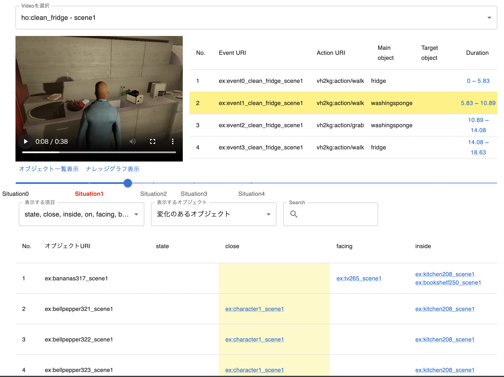
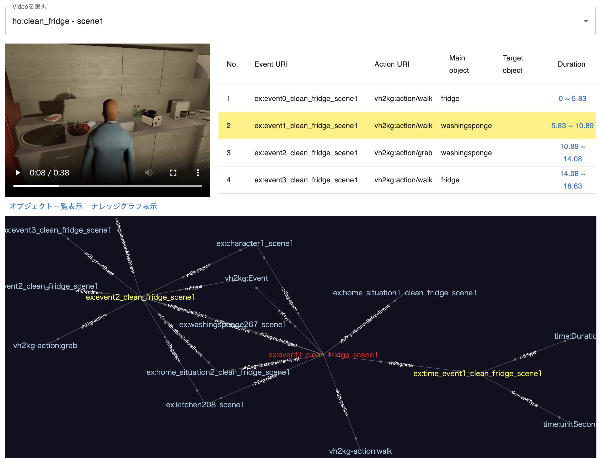

[[Japanese]](./README_ja.md)

# VirtualHome2KG Visualization Tool

<table width="100%">
<tr>
<td width="50.5%"></td>
<td width="49.5%"></td>
</tr>
</table>

## Requirements

- Linux or Mac with Docker and Docker Compose installed

## How to start locally

- Clone https://github.com/aistairc/virtualhome2kg_visualization.
- Switch to branch `kgrc4si`.
- Run `docker compose up --build`.
- You can see the result at http://localhost:8080.

## How to update data
This repository is a fork of `kgrc4si` from https://github.com/KnowledgeGraphJapan/KGRC-RDF and can be synchronized with the following procedure when there is a change in the RDF data, etc. owned by that branch.

```
git remote add upstream git@github.com:KnowledgeGraphJapan/KGRC-RDF.git # set upstream repository
git fetch upstream # update the upstream repository
git merge upstream/kgrc4si # Sync with upstream branch
```
